<h1 align="center">VMCAI 2021 Documentation</h1>

This document summarizes how to set up the Virtual Machine (<a href="https://zenodo.org/record/4017293/#%5C.X4c%5C_mtAzaUk">https://zenodo.org/record/4017293/#%5C.X4c%5C_mtAzaUk</a>) provided for the 22nd International Conference on Verification, Model Checking, and Abstract Interpretation (VMCAI 2021) and the steps to run GPURepair, AutoSync and GPUVerify. GPURepair is our tool described in the paper (submission 43 in VMCAI tool paper track). AutoSync <a href="#1">[1]</a> is a prior work that is compared against GPURepair. GPUVerify <a href="#2">[2]</a> is the verifier that GPURepair and AutoSync use as an oracle in the kernel repair process. The binaries of GPURepair, GPUVerify and the code of AutoSync are licensed under Ms-PL.

<h1>Table of Contents</h1>

[A. Setting up the Virtual Machine](#a-setting-up-the-virtual-machine)
&nbsp;&nbsp;&nbsp;&nbsp;[A.1. Resource Requirements](#a1-resource-requirements)
&nbsp;&nbsp;&nbsp;&nbsp;[A.2. Artifact Setup](#a2-artifact-setup)
[B. Replicating the Experiment Results](#b-replicating-the-experiment-results)
&nbsp;&nbsp;&nbsp;&nbsp;[B.1. Running the testsuite (Takes 2 days)](#b1-running-the-testsuite--takes-2-days-)
&nbsp;&nbsp;&nbsp;&nbsp;[B.2. Running the mini testsuite (Takes 3 hours)](#b2-running-the-mini-testsuite--takes-3-hours-)
&nbsp;&nbsp;&nbsp;&nbsp;[B.3. Analyzing the Results](#b3-analyzing-the-results)
[C. Basic Repair](#c-basic-repair)
&nbsp;&nbsp;&nbsp;&nbsp;[C.1. Using GPUVerify to verify the kernel](#c1-using-gpuverify-to-verify-the-kernel)
&nbsp;&nbsp;&nbsp;&nbsp;[C.2. Repair the kernel using GPURepair](#c2-repair-the-kernel-using-gpurepair)
&nbsp;&nbsp;&nbsp;&nbsp;&nbsp;&nbsp;&nbsp;&nbsp;[C.2.1. Enabling the MaxSAT solver](#c21-enabling-the-maxsat-solver)
&nbsp;&nbsp;&nbsp;&nbsp;&nbsp;&nbsp;&nbsp;&nbsp;[C.2.2. Disabling instrumentation of grid-level barriers](#c22-disabling-instrumentation-of-grid-level-barriers)
&nbsp;&nbsp;&nbsp;&nbsp;&nbsp;&nbsp;&nbsp;&nbsp;[C.2.3. Disabling inspection of pre-existing barriers](#c23-disabling-inspection-of-pre-existing-barriers)
&nbsp;&nbsp;&nbsp;&nbsp;&nbsp;&nbsp;&nbsp;&nbsp;[C.2.4. Disabling instrumentation of grid-level barriers and inspection of pre-existing barriers](#c24-disabling-instrumentation-of-grid-level-barriers-and-inspection-of-pre-existing-barriers)
&nbsp;&nbsp;&nbsp;&nbsp;[C.3. Repair the kernel using AutoSync](#c3-repair-the-kernel-using-autosync)
[D. Test Runners](#d-test-runners)
&nbsp;&nbsp;&nbsp;&nbsp;[D.1. Running the testsuite using GPUVerify](#d1-running-the-testsuite-using-gpuverify)
&nbsp;&nbsp;&nbsp;&nbsp;[D.2. Running the testsuite using GPURepair](#d2-running-the-testsuite-using-gpurepair)
&nbsp;&nbsp;&nbsp;&nbsp;&nbsp;&nbsp;&nbsp;&nbsp;[D.2.1. Enabling the MaxSAT solver](#d21-enabling-the-maxsat-solver)
&nbsp;&nbsp;&nbsp;&nbsp;&nbsp;&nbsp;&nbsp;&nbsp;[D.2.2. Disabling instrumentation of grid-level barriers](#d22-disabling-instrumentation-of-grid-level-barriers)
&nbsp;&nbsp;&nbsp;&nbsp;&nbsp;&nbsp;&nbsp;&nbsp;[D.2.3. Disabling inspection of pre-existing barriers](#d23-disabling-inspection-of-pre-existing-barriers)
&nbsp;&nbsp;&nbsp;&nbsp;&nbsp;&nbsp;&nbsp;&nbsp;[D.2.4. Disabling instrumentation of grid-level barriers and inspection of pre-existing barriers](#d24-disabling-instrumentation-of-grid-level-barriers-and-inspection-of-pre-existing-barriers)
&nbsp;&nbsp;&nbsp;&nbsp;[D.3. Running the testsuite using AutoSync](#d3-running-the-testsuite-using-autosync)
[References](#references)

# A. Setting up the Virtual Machine

Download the Virtual Machine (VM) from <a href="https://zenodo.org/record/4017293\#\.X4c\_mtAzaUk">here</a> and open it in VirtualBox. The username and password for the VM have been provided by the organizing committee in the description. Download the artifacts for GPURepair from <a href="https://drive.google.com/open?id=1o3RF0deGuEulsb-GpTJLFEf1PWJxiopC">https://drive.google.com/open?id=1o3RF0deGuEulsb-GpTJLFEf1PWJxiopCA</a>

## A.1. Resource Requirements

To run GPURepair, the virtual machine needs a minimum of <b>1 CPU</b> and <b>4GB RAM</b>. The CPU frequency of the underlying host machine should be at least <b>2.00 GHz</b>. This requirement assumes that there are no other processes (either on the host or the guest) that consume high amounts of CPU or Disk I/O running in parallel.

## A.2. Artifact Setup

Copy the artifacts.zip file to the home directory of the user (<b>/home/vmcai2021</b>). As mentioned in the <a href="https://zenodo.org/record/4017293\#\.X4c\_mtAzaUk">documentation</a> provided by VMCAI, the virtual machine is running an SSH server, so that can be used to copy the zip file from the host machine to the VM. Extract the contents of the zip file here as shown in the below figure.

<div align="center">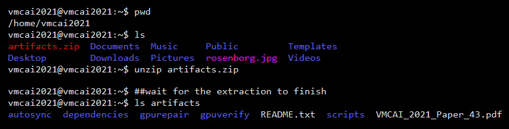</div>

Below is a description of the folders extracted from the zip file.

| Directory                                                    | Description                                                  |
| :----------------------------------------------------------- | :----------------------------------------------------------- |
| autosync                                                     | This directory contains the binaries of AutoSync             |
| dependencies                                                 | Running GPURepair, AutoSync and GPUVerify on the VM require a couple of Ubuntu packages and Python packages to be installed. This folder contains these packages for offline installation. The Latex packages required for generating the final report are also available in this folder |
| gpurepair                                                    | This directory contains the binaries of GPURepair            |
| gpuverify                                                    | This directory contains the binaries of GPUVerify            |
| scripts                                                      | Contains the bootstrap scripts to get the VM ready           |
| gpurepair/tests<br/>autosync/tests<br/>gpuverify/tests       | The folders containing the testsuites for running the experiments |
| gpurepair/tests/testsuite<br/>autosync/tests/testsuite<br/>gpuverify/tests/testsuite | These folders contain the complete testsuite used to replicate the experimental results mentioned in the paper |
| gpurepair/tests/testsuite_mini<br/>autosync/tests/testsuite_mini<br/>gpuverify/tests/testsuite_mini | These folders contain a subset of the testsuite used to perform experiments for the artifact evaluation |
| gpurepair/tests-bkp<br/>autosync/tests-bkp<br/>gpuverify/tests-bkp | These folders contain the same files as gpurepair/tests, autosync/tests and gpuverify/tests respectively. They are a backup of the test suites mentioned above. This backup is useful if you would like to restore the tests folder to it's original state |
| gpurepair/bin/template                                       | This folder contains the templates to generate the Latex report |
| gpurepair/bin/manual                                         | This folder contains a list of kernels that had invariant or assertion errors returned by GPUVerify. Since GPUVerify uses the same status code for all errors (data races, divergence, invariant or assertion) errors, there is no way of differentiating these errors from the GPUVerify log files. We had manually analyzed these files and categorized them to identify the repairable and unrepairable errors.<br/>Please note that these files are used only for determining the unrepairable errors identified by GPUVerify for generating Table 2 in the paper (Table 2 in the generated report). By default the error is considered as a repairable error if GPUVerify identifies an error and it is not mentioned in these files.<br/>**These files are not required for the working of any tool and GPURepair does not use them in the repair process.** |
| gpuverify/bugle<br/>gpuverify/libclc                         | These folders contain the header files for bugle and liclc   |

The **scripts** folder has a bash script named **setup.sh**. This script will install all the dependencies needed for GPURepair and configure permissions on the necessary files. Run this script using the bash command as shown below.

```bash
cd /home/vmcai2021/artifacts
bash ./scripts/setup.sh
```

<div align="center">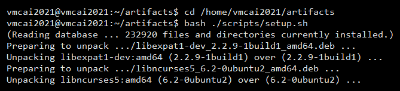</div>

Once the required packages are successfully installed, the VM is ready to run GPURepair, AutoSync and GPUVerify. The setup script throws an error if it is run from anywhere besides the home directory of the user [**/home/vmcai2021/artifacts**].

# B. Replicating the Experiment Results

In this section, we cover how the experimental results presented in the paper can be reproduced. Details on how to use the individual tools and how to independently run the test suites are covered in Section C and Section D. All those details are abstracted here in the form of a bash script.

The bash script takes two inputs - a) the testsuite folder and b) the number of time the experiment needs to be repeated. The script does the following:

1. Runs GPUVerify on all the kernels in the folder
2. Runs AutoSync on all the CUDA kernels in the folder. It also runs GPUVerify on the solutions provided by AutoSync to identify false positives
3. Runs GPURepair with the default configuration on all the kernels in the folder
4. Runs GPURepair with MaxSAT as the solver
5. Runs GPURepair with the usage of grid-level barriers disabled
6. Runs GPURepair with the inspection of pre-existing barriers disabled
7. Runs GPURepair with the usage of grid-level barriers and the inspection of pre-existing barriers disabled
8. Generates the detailed and summary reports consolidating the results of these runs

## B.1. Running the testsuite (Takes 2 days)

The experimental analysis in the paper was performed on a total of **748** kernels (**266** CUDA and **482** OpenCL). This benchmark set is a union of four independent test suites and publicly available sample programs. The following table summarizes the various sources of the kernels.

| Source                                                       | Kernels |
| ------------------------------------------------------------ | ------- |
| GPUVerify Test Suite (Inc. 482 OpenCL Kernels)               | 658     |
| [NVIDIA GPU Computing SDK v5.0](https://developer.nvidia.com/cuda-toolkit-50-archive) | 56      |
| AutoSync Micro Benchmarks <a href="#1">[1]</a>               | 8       |
| GPURepair Test Suite (Inc. 16 examples for CUDA Cooperative Groups) | 26      |

We used a [Standard\_F2s\_v2 Azure](https://docs.microsoft.com/en-us/azure/virtual-machines/fsv2-series)<sup>&reg;</sup> virtual machine which has 2 vCPUs with a clock speed of 3.40 GHz and 4 GB of memory. On this machine, it took us around 14.5 hours for one complete run of all these steps. We run the experiments 3 times and summarize the results. If the resources provided to the virtual machine are less than this, it could take a lot more time than this.

## B.2. Running the mini testsuite (Takes 3 hours)

Given that this testsuite is impractical for the artifact evaluation, we introduce another testsuite named **testsuite\_mini** which contains **150 examples** covering several of the important scenarios from the main testsuite.

When we ran this testsuite on the virtual machine, it took us approximately **3 hours** for a single run when the VM was provided with **1 CPU** and **4 GB** of memory. The host machine had **2 cores** with a clock speed of **2.00 GHz** and **8 GB** of memory. Please note that the time will change based on the resources provided to the VM.

The composition of testsuite_mini is as follows:

| Source                                                       | Kernels |
| ------------------------------------------------------------ | ------- |
| GPUVerify Test Suite (Inc. 75 OpenCL Kernels)                | 117     |
| [NVIDIA GPU Computing SDK v5.0](https://developer.nvidia.com/cuda-toolkit-50-archive) | 14      |
| AutoSync Micro Benchmarks <a href="#1">[1]</a>               | 7       |
| GPURepair Test Suite (Inc. 6 examples for CUDA Cooperative Groups) | 12      |

All the tools have this testsuite to maintain parity. This testsuite is available in the **testsuite_mini** folders present in the tool directories, which can be viewed using the following commands.

```bash
cd /home/vmcai2021/artifacts
ls ./gpuverify/tests/testsuite_mini
ls ./gpurepair/tests/testsuite_mini
ls ./autosync/tests/testsuite_mini
```

Execute the following commands to run the experiments on testsuite\_mini **once**. If you would like you run the experiments multiple times, please change the number from 1 to the desired value. After all the tests are run, the script displays a message mentioning that the results and the report are available in the **results** directory as shown in the below figure. Please note that this command deletes the **results** directory and recreates it every time, so if you have data from previous experiments, please copy it to another location.

```bash
cd /home/vmcai2021/artifacts/scripts
bash ./run_experiments.sh testsuite_mini 1
```

<div align="center">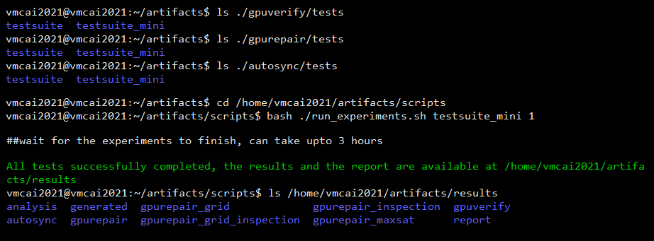</div>

The  below figure shows the expected folder structure of the **results** directory if the experiments were successfully run.

<div align="center">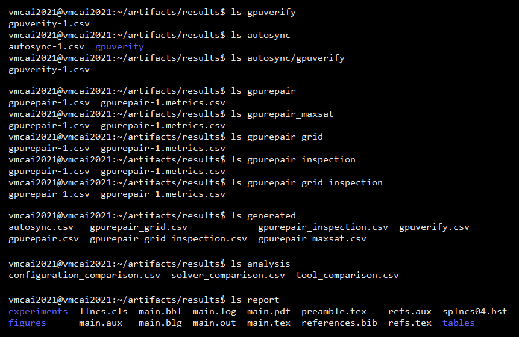</div>

## B.3. Analyzing the Results

To make the analysis of the experimental data easy, we generate a Latex file with all the important information that is needed to understand the working of GPURepair. The Latex files are compiled as a part of the above bash script and the PDF file will be available at **/home/vmcai2021/artifacts/results/report/main.pdf**. This file is generated from a template stored at /home/vmcai2021/artifacts/gpurepair/bin/template (please do not modify the template). The PDF provides four segments of information:

1. It provides a comparison between GPURepair and AutoSync in three dimensions - a) how many benchmarks were repaired, optimized and resulted in errors, b) a time comparison between both the tools and c) a comparison between the number of verifier calls made by both the tools
2. It provides details on the source code size of the testsuite through number of lines of code, the number of Boogie commands that were generated for the kernels and the number of instrumented barriers
3. It provides a time comparison between the **mhs** and the **MaxSAT** strategies
4. It compares all the different configurations of GPURepair along with AutoSync in terms of the time taken to run, number of solver and verifier calls made by them

The PDF file should provide all the necessary information to compare against the submitted paper. In addition, the script provides a more granular view of the data in the form of csv files. We briefly describe the folders that are generated in the below table. These will be useful only  if any analysis needs to be performed at a benchmark level.

| Directory                                                    | Notes                                                        |
| ------------------------------------------------------------ | ------------------------------------------------------------ |
| gpuverify                                                    | This directory contains one file per run. The file contains the end result of the verification process along with the total time taken for each benchmark and the breakup of the time by each stage of GPUVerify |
| autosync                                                     | This directory also contains one file per run. In this file, the time taken for each benchmark along with the number of verifier calls made by AutoSync and the number of changes recommended by it are stored |
| autosync/gpuverify                                           | For each run of AutoSync, there will also be a file in this directory. This file is generated by GPUVerify when it is run on the solutions provided by AutoSync. The format of this file is the same as described above for gpuverify. The information from these files is used to find false positives for AutoSync |
| gpurepair, gpurepair\_maxsat, gpurepair\_grid, gpurepair\_inspection and gpurepair\_grid\_inspection | For each configuration of GPURepair, one directory is created. Each directory has two files per run. The file gpurepair-#.csv contains the end result of the verification process along with the total time taken for each benchmark and the time of individual stages of GPURepair similar to GPUVerify. The file gpurepair-#.metrics.csv contains 37 metrics per benchmark covering the number of lines, blocks, calls to the verifier, how many times each solver was used, the time taken by the solver, etc. |
| generated                                                    | This directory and the files in it are created after all the runs are complete. It contains one file for GPUVerify, one file for AutoSync and one file for each configuration of GPURepair. The metrics obtained in the individual runs of the script are consolidated in this directory. Numeric metrics like the time taken, verifier calls, solver calls, time taken by the solvers, etc. are averaged and written to these files. The repair (resp. verification) status of GPURepair or AutoSync (resp. GPUVerify) is also written in these files. If the status in all the runs is the same, it is taken as it is. If the status was different in the runs, the status that occurred the most is considered |
| analysis                                                     | This directory provides side-by-side comparison for each benchmark in the testsuite. Every file contains the total time taken, number of solver and verifier calls made for each benchmark. **configuration\_comparison.csv** compares all the configurations of GPURepair along with AutoSync. **solver\_comparison.csv** compares the **mhs** (default) strategy of GPURepair with the **MaxSAT** strategy. **tool\_comparison.csv** provides a comparison for the performance of GPURepair against AutoSync for the CUDA kernels |
| report                                                       | This directory contains the tex files to generate the summary report of the experiments. The directory contains the **main.pdf** which will have all the details related to the experiments. |

Please note that the results generating from running testsuite_mini cannot be compared with the results mentioned in the paper. The expected results can be compared with the directory present at **/home/vmcai2021/artifacts/expected-results**. The generated PDF can be compared with the PDF present at **/home/vmcai2021/artifacts/expected-results/report/main.pdf**. The time metrics in the generated report might vary to this depending on the resources provided to the VM.

The next two sections are not necessary for replicating the results described in the paper. However they are useful for running a smaller subset of the testsuite.

# C. Basic Repair

As discussed in the paper, GPURepair and AutoSync leverage GPUVerify as the verification oracle to facilitate the repair process. So binaries of all these applications are needed to run the experiments. In this section, we provide a basic example for each of the tools showcasing how they can be used. For this purpose, we use a CUDA kernel that a data race in it. The source code of this kernel can be seen below using the following commands.

```bash
cd /home/vmcai2021/artifacts/gpuverify
vim ./tests/testsuite/Bugged/race/kernel.cu
```

<div align="center">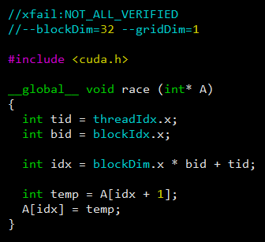</div>

## C.1. Using GPUVerify to verify the kernel

To verify this kernel, run the command

```bash
cd /home/vmcai2021/artifacts/gpuverify
python3 ./GPUVerify.py ./tests/testsuite/Bugged/race/kernel.cu --blockDim=32 --gridDim=1
```

This command verifies the specified kernel and outputs that a data race exists in it. This can be seen in the below figure.

<div align="center">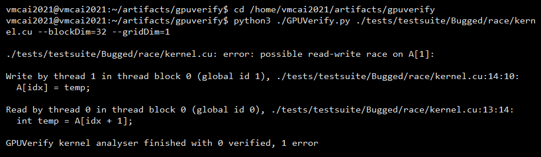</div>

## C.2. Repair the kernel using GPURepair

To repair kernel shown in the previous section [**/home/vmcai2021/artifacts/gpurepair/tests/testsuite/Bugged/race/kernel.cu**], run the command

```bash
cd /home/vmcai2021/artifacts/gpurepair
python3 ./GPURepair.py ./tests/testsuite/Bugged/race/kernel.cu --blockDim=32 --gridDim=1
```

This command repairs the kernel and prints the number of changes that are required to correct this kernel. This can be seen in the below figure. The changes that are needed are written to a summary file at the same location where the kernel is. This file can be opened with the command

```bash
cat ./tests/testsuite/Bugged/race/kernel.summary
```

The changes in the summary file specify the file and line where a barrier needs to be added or removed. The fixed program is also available in its Boogie Intermediate Representation (IR) at the same location with the extension **.fixed.cbpl**

<div align="center">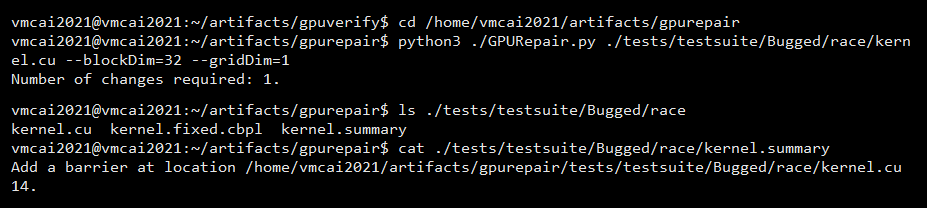</div>

Add the barrier at line number 14 as specified in the summary file to obtain the repaired kernel. The repaired kernel will look like below.

<div align="center">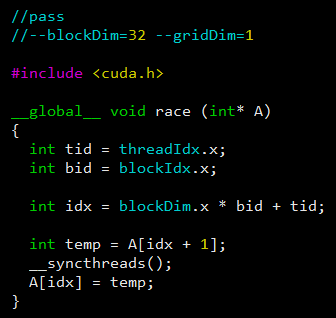</div>

Run GPUVerify on the repaired kernel to confirm that the repair process worked. This can be seen below.

```bash
python3 ../gpuverify/GPUVerify.py ./tests/testsuite/Bugged/race/kernel.cu --blockDim=32 --gridDim=1
```

<div align="center">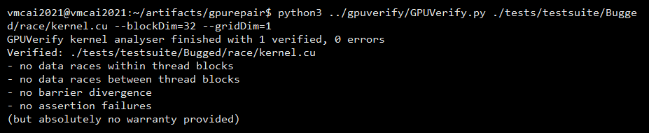</div>

All the command-line options available for GPUVerify at https://github.com/mc-imperial/gpuverify/blob/master/Documentation/basic_usage.rst can be used with GPURepair as well. GPURepair passes these command-line options, if specified during its invocation, to GPUVerify for the verification process.

Besides the verification options provided by GPUVerify, GPURepair provides command-line options to change the solver type used in the repair process, disable instrumentation of grid-level barriers and inspection of programmer inserted barriers. It also provides additional logging options that log several metrics during the repair process, including the clauses that were generated. A reference of these options can be accessed using the command

```bash
python3 ./GPURepair.py --help
```

<div align="center">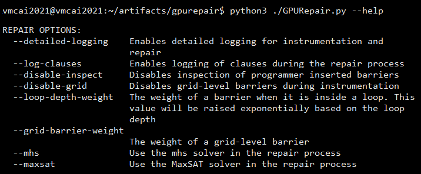</div>

By default, GPURepair uses the mhs solver, enables the instrumentation of grid-level barriers and inspection of pre-existing barriers. In the following subsections, we give an overview of the other configurations that we use to run the experiments in the paper:

### C.2.1. Enabling the MaxSAT solver

The following command asks GPURepair to use the MaxSAT solver to repair the kernel.

```bash
python3 ./GPURepair.py ./tests/testsuite/Bugged/race/kernel.cu --blockDim=32 --gridDim=1 --maxsat
```

### C.2.2. Disabling instrumentation of grid-level barriers

The following command asks GPURepair to disable instrumentation of grid-level barriers. Please note that this configuration of GPURepair cannot fix kernels that have inter-block data races.

```bash
python3 ./GPURepair.py ./tests/testsuite/Bugged/race/kernel.cu --blockDim=32 --gridDim=1 --disable-grid
```

### C.2.3. Disabling inspection of pre-existing barriers

The following command asks GPURepair not to inspect pre-existing barriers. GPURepair in this configuration cannot remove barriers present in the source kernel even if an optimization opportunity exists.

```bash
python3 ./GPURepair.py ./tests/testsuite/Bugged/race/kernel.cu --blockDim=32 --gridDim=1 --disable-inspect
```

### C.2.4. Disabling instrumentation of grid-level barriers and inspection of pre-existing barriers

The following command is a combination of the above two options.

```bash
python3 ./GPURepair.py ./tests/testsuite/Bugged/race/kernel.cu --blockDim=32 --gridDim=1 --disable-grid --disable-inspect
```

## C.3. Repair the kernel using AutoSync

For AutoSync to repair a kernel, it needs the kernel code to be in the folder where the source code of AutoSync is present. Otherwise, it would throw an exception when it parses the error returned by GPUVerify. To repair this kernel using AutoSync, run the below commands

```bash
cd /home/vmcai2021/artifacts/autosync
cp ./tests/testsuite/Bugged/race/kernel.cu .
python3 ./autosync.py kernel.cu --blockDim=32 --gridDim=1
```

This command repairs the kernel and prints the number of changes and verifier calls that are required to correct this kernel. This can be seen below.

<div align="center">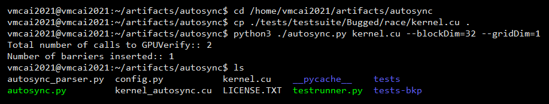</div>

The repaired kernel is available in the same folder with the name **kernel\_autosync.cu**

# D. Test Runners

The entire test suite used in the experimental evaluation of GPURepair are available in the **testsuite** folders present in the tool directories, which can be viewed using the following commands.

```bash
cd /home/vmcai2021/artifacts
ls ./gpuverify/tests/testsuite
ls ./gpurepair/tests/testsuite
ls ./autosync/tests/testsuite
```

<div align="center">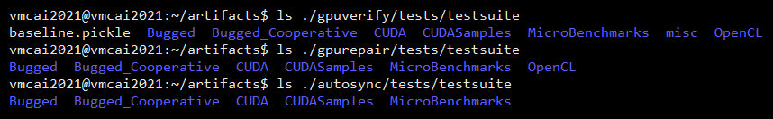</div>

The OpenCL benchmarks are exclusive to GPURepair and GPUVerify since AutoSync cannot repair OpenCL kernels. Besides that, all the three testsuites follow a similar structure and have the same kernels. As seen in the kernel code examples in Section 3, every kernel has two comments at the beginning of the file. The first line is the expected result, the test runners of GPURepair and GPUVerify use this to provide additional feedback to the user in case the actual result doesn't match the expected result. The second line contains the input to the tool. The test runners of GPURepair, AutoSync and GPUVerify  use this information when running the test case. Since the expected result for all the three tools need not be the same, we maintain independent testsuites for them.

## D.1. Running the testsuite using GPUVerify

To run the benchmark suite, use the following command

```bash
cd /home/vmcai2021/artifacts/gpuverify
python3 ./gvtester.py ./tests/testsuite --threads=1 --time-as-csv --csv-file=gpuverify.csv
```

This command scans for CUDA and OpenCL kernels in the given folder, runs GPUVerify on these kernels, and summarizes the results in a CSV file. The test file syntax of GPUVerify is documented at https://github.com/mc-imperial/gpuverify/blob/master/Documentation/developer_guide.rst under the Test Framework section. The output of this can be seen below.

<div align="center">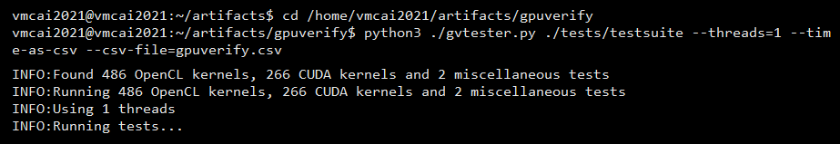</div>

## D.2. Running the testsuite using GPURepair

To run the benchmark suite, use the command

```bash
cd /home/vmcai2021/artifacts/gpurepair
python3 ./grtester.py ./tests/testsuite --threads=1 --time-as-csv --csv-file=gpurepair.csv --gropt=--detailed-logging
```

Similar to GPUVerify, this command scans for CUDA and OpenCL kernels in the given folder, runs GPURepair on these kernels, and summarizes the results in a CSV file. We leverage the same test file syntax as GPUVerify. The output of this can be seen below.

<div align="center">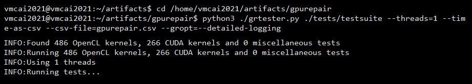</div>

A backup of the tests is available at **/home/vmcai2021/artifacts/gpurepair/tests-bkp**. This backup will be useful to clear all the summary and fixed Boogie files. The **testsuite** folder can be removed and copied back from the **tests-bkp** folder to bring it back to its original state.

As mentioned in Section C.2. GPURepair can be run in several different configurations. The command used in this section uses the default configuration with detailed logging enabled. The other configurations that are used to run the experiments in the paper are as follows:

### D.2.1. Enabling the MaxSAT solver

The following command enables the MaxSAT solver when GPURepair is run for each benchmark in the testsuite.

```bash
python3 ./grtester.py ./tests/testsuite --threads=1 --time-as-csv --csv-file=gpurepair.csv --gropt=--detailed-logging --gropt=--maxsat
```

### D.2.2. Disabling instrumentation of grid-level barriers

The following command disables instrumentation of grid-level barriers when GPURepair is run for each benchmark in the testsuite.

```bash
python3 ./grtester.py ./tests/testsuite --threads=1 --time-as-csv --csv-file=gpurepair.csv --gropt=--detailed-logging --gropt=--disable-grid
```

### D.2.3. Disabling inspection of pre-existing barriers

The following command disables the inspection of pre-existing barriers when GPURepair is run for each benchmark in the testsuite.

```bash
python3 ./grtester.py ./tests/testsuite --threads=1 --time-as-csv --csv-file=gpurepair.csv --gropt=--detailed-logging --gropt=--disable-inspect
```

### D.2.4. Disabling instrumentation of grid-level barriers and inspection of pre-existing barriers

The following command is a combination of the above two options.

```bash
python3 ./grtester.py ./tests/testsuite --threads=1 --time-as-csv --csv-file=gpurepair.csv --gropt=--detailed-logging --gropt=--disable-grid --gropt=--disable-inspect
```

## D.3. Running the testsuite using AutoSync

To run the benchmark suite using AutoSync, use the command

```bash
cd /home/vmcai2021/artifacts/autosync
python3 ./testrunner.py ./tests/testsuite
```

This command scans for CUDA kernels in the given folder, runs AutoSync on these kernels, and summarizes the results on the screen. There are five metrics printed on the screen for each kernel separated by a comma. The first field represents the kernel name; the second field provides the time taken by AutoSync; the third and fourth fields represent the number of calls made to the verifier and the number of changes made to the kernel, respectively. If AutoSync crashes, the error message is returned as the fifth field. The number of changes made to the kernel is returned as -1 if AutoSync crashes or determines that it cannot repair the kernel.

<div align="center">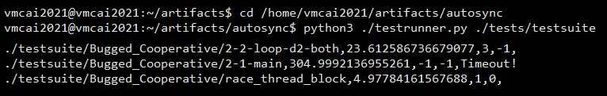</div>

# References

<a id="1">[1]</a> 
Sourav Anand and Nadia Polikarpova.
Automatic Synchronization for GPU Kernels.
In FMCAD 2018, pages 1-9. IEEE, 2018.

<a id="2">[2]</a> 
Adam Betts, Nathan Chong, Alastair F. Donaldson, Shaz Qadeer and Paul Thomson.
GPUVerify: A Verifier for GPU Kernels.
In OOPSLA 2012, pages 113-132. ACM, 2012.